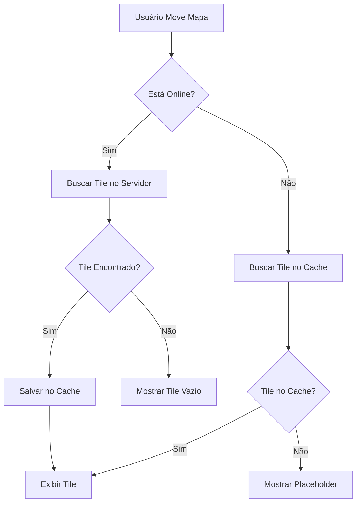

# 🗺️ Guia Completo - Sistema de Mapas Offline

**Sistema:** SoloForte  
**Versão:** 2.0  
**Módulo:** Mapas e Geolocalização  
**Data:** 19 de Outubro de 2025

---

## 📋 Índice

1. [Situação Atual](#situação-atual)
2. [Arquitetura Proposta](#arquitetura-proposta)
3. [Implementação Passo a Passo](#implementação-passo-a-passo)
4. [Estratégias de Cache](#estratégias-de-cache)
5. [Sincronização e Fallback](#sincronização-e-fallback)
6. [Testes e Validação](#testes-e-validação)
7. [Troubleshooting](#troubleshooting)

---

## 🔍 SITUAÇÃO ATUAL

### Arquivos Afetados

```
/components/MapTilerComponent.tsx    - Componente principal de mapa
/components/MapDrawing.tsx           - Sistema de desenho de polígonos
/components/MapLayerSelector.tsx     - Seletor de camadas
/components/Dashboard.tsx            - Usa o mapa
/components/CheckInOut.tsx           - Depende de geolocalização
```

### Problema Atual

```typescript
// ❌ PROBLEMA: Tiles carregados sempre da internet
const updateMapLayer = (mapInstance: any, style: string) => {
  let tileUrl = '';
  
  switch (style) {
    case 'satellite':
      tileUrl = 'https://mt1.google.com/vt/lyrs=s&x={x}&y={y}&z={z}';
      break;
    case 'streets':
      tileUrl = 'https://{s}.tile.openstreetmap.org/{z}/{x}/{y}.png';
      break;
    case 'terrain':
      tileUrl = 'https://{s}.tile.opentopomap.org/{z}/{x}/{y}.png';
      break;
  }
  
  // Nenhum cache implementado
  L.tileLayer(tileUrl, { maxZoom: 19 }).addTo(mapInstance);
};
```

### Impactos

| Funcionalidade | Requer Internet | Impacto Offline |
|----------------|-----------------|-----------------|
| Visualizar mapa | ✅ Sim | ❌ Tela branca |
| Desenhar áreas | ✅ Sim | ❌ Não funciona |
| Ver polígonos salvos | ⚠️ Parcial | ⚠️ Sem mapa de fundo |
| Marcadores de ocorrências | ⚠️ Parcial | ⚠️ Sem mapa de fundo |
| Check-in GPS | ❌ Não | ✅ Funciona |
| NDVI overlay | ✅ Sim | ❌ Não funciona |

---

## 🏗️ ARQUITETURA PROPOSTA

### Visão Geral

```
┌──────────────────────────────────────────────────┐
│              APLICATIVO SOLOFORTE                │
├──────────────────────────────────────────────────┤
│                                                  │
│  ┌────────────────┐      ┌────────────────┐     │
│  │  MapComponent  │◄────►│  TileManager   │     │
│  └────────────────┘      └────────────────┘     │
│         ▲                        │              │
│         │                        ▼              │
│         │              ┌────────────────┐       │
│         │              │  TileCache DB  │       │
│         │              └────────────────┘       │
│         │                        │              │
│         ▼                        ▼              │
│  ┌────────────────┐      ┌────────────────┐     │
│  │  Leaflet.js    │      │  IndexedDB     │     │
│  └────────────────┘      └────────────────┘     │
│         │                        ▲              │
│         ▼                        │              │
│  ┌─────────────────────────────────────┐        │
│  │       Network Manager                │       │
│  │  (Online/Offline Detection)          │       │
│  └─────────────────────────────────────┘        │
│         │                        │              │
│         ▼                        ▼              │
│  ┌─────────────┐         ┌─────────────┐        │
│  │ Tile Server │         │ Local Cache │        │
│  │  (Online)   │         │  (Offline)  │        │
│  └─────────────┘         └─────────────┘        │
└──────────────────────────────────────────────────┘
```

### Fluxo de Dados



---

## 💻 IMPLEMENTAÇÃO PASSO A PASSO

### ETAPA 1: Instalar Dependências (15 min)

```bash
# 1. Plugins do Capacitor
npm install @capacitor/preferences
npm install @capacitor/network
npm install @capacitor/filesystem

# 2. Biblioteca de cache de tiles
npm install leaflet.offline
npm install localforage

# 3. Types do TypeScript
npm install -D @types/leaflet
```

### ETAPA 2: Criar TileManager (1-2h)

**Arquivo:** `/utils/TileManager.ts`

```typescript
import localforage from 'localforage';
import { Network } from '@capacitor/network';
import { logger } from './logger';

interface CachedTile {
  key: string;
  url: string;
  blob: Blob;
  timestamp: number;
  zoom: number;
  x: number;
  y: number;
}

export class TileManager {
  private static instance: TileManager;
  private cache: LocalForage;
  private isOnline: boolean = true;
  private maxCacheSize: number = 100 * 1024 * 1024; // 100MB
  private maxTileAge: number = 7 * 24 * 60 * 60 * 1000; // 7 dias

  private constructor() {
    // Criar store do IndexedDB para tiles
    this.cache = localforage.createInstance({
      name: 'soloforte-map-tiles',
      storeName: 'tiles',
      description: 'Cache de tiles para mapas offline'
    });

    this.initNetworkListener();
  }

  static getInstance(): TileManager {
    if (!TileManager.instance) {
      TileManager.instance = new TileManager();
    }
    return TileManager.instance;
  }

  private async initNetworkListener() {
    // Status inicial
    const status = await Network.getStatus();
    this.isOnline = status.connected;

    // Listener de mudanças
    Network.addListener('networkStatusChange', (status) => {
      this.isOnline = status.connected;
      logger.log(`📶 Status de rede mudou: ${status.connected ? 'Online' : 'Offline'}`);
    });
  }

  /**
   * Obter tile (do cache ou da rede)
   */
  async getTile(url: string, x: number, y: number, z: number): Promise<string> {
    const key = this.getTileKey(x, y, z);

    // 1. Tentar cache primeiro (offline-first)
    const cachedTile = await this.getFromCache(key);
    if (cachedTile) {
      logger.log(`✅ Tile do cache: ${key}`);
      return URL.createObjectURL(cachedTile.blob);
    }

    // 2. Se online, buscar da rede
    if (this.isOnline) {
      try {
        const blob = await this.fetchTileFromNetwork(url);
        
        // Salvar no cache
        await this.saveToCache(key, url, blob, x, y, z);
        
        logger.log(`📥 Tile da rede (salvo no cache): ${key}`);
        return URL.createObjectURL(blob);
      } catch (error) {
        logger.error(`❌ Erro ao buscar tile: ${url}`, error);
        return this.getPlaceholderTile();
      }
    }

    // 3. Offline sem cache = placeholder
    logger.log(`⚠️ Tile não disponível offline: ${key}`);
    return this.getPlaceholderTile();
  }

  /**
   * Buscar tile da rede
   */
  private async fetchTileFromNetwork(url: string): Promise<Blob> {
    const response = await fetch(url, {
      mode: 'cors',
      cache: 'force-cache' // Usar cache do navegador quando possível
    });

    if (!response.ok) {
      throw new Error(`HTTP ${response.status}`);
    }

    return await response.blob();
  }

  /**
   * Salvar tile no cache
   */
  private async saveToCache(
    key: string,
    url: string,
    blob: Blob,
    x: number,
    y: number,
    z: number
  ): Promise<void> {
    try {
      const cachedTile: CachedTile = {
        key,
        url,
        blob,
        timestamp: Date.now(),
        zoom: z,
        x,
        y
      };

      await this.cache.setItem(key, cachedTile);
      
      // Verificar tamanho do cache
      await this.cleanupCacheIfNeeded();
    } catch (error) {
      logger.error('❌ Erro ao salvar tile no cache:', error);
    }
  }

  /**
   * Obter tile do cache
   */
  private async getFromCache(key: string): Promise<CachedTile | null> {
    try {
      const cachedTile = await this.cache.getItem<CachedTile>(key);
      
      if (!cachedTile) return null;

      // Verificar se tile está muito antigo
      const age = Date.now() - cachedTile.timestamp;
      if (age > this.maxTileAge) {
        logger.log(`🗑️ Tile expirado: ${key}`);
        await this.cache.removeItem(key);
        return null;
      }

      return cachedTile;
    } catch (error) {
      logger.error('❌ Erro ao buscar tile do cache:', error);
      return null;
    }
  }

  /**
   * Gerar chave única para tile
   */
  private getTileKey(x: number, y: number, z: number): string {
    return `tile_${z}_${x}_${y}`;
  }

  /**
   * Retornar tile placeholder (cinza com texto)
   */
  private getPlaceholderTile(): string {
    // Canvas com texto "Offline"
    const canvas = document.createElement('canvas');
    canvas.width = 256;
    canvas.height = 256;
    const ctx = canvas.getContext('2d');
    
    if (ctx) {
      ctx.fillStyle = '#f3f4f6';
      ctx.fillRect(0, 0, 256, 256);
      ctx.fillStyle = '#9ca3af';
      ctx.font = '14px sans-serif';
      ctx.textAlign = 'center';
      ctx.fillText('Offline', 128, 128);
    }

    return canvas.toDataURL();
  }

  /**
   * Limpar cache se estiver muito grande
   */
  private async cleanupCacheIfNeeded(): Promise<void> {
    try {
      const keys = await this.cache.keys();
      const cacheSize = await this.calculateCacheSize();

      if (cacheSize > this.maxCacheSize) {
        logger.log(`🧹 Cache muito grande (${(cacheSize / 1024 / 1024).toFixed(2)}MB), limpando...`);
        
        // Obter todos os tiles
        const tiles: Array<{ key: string; tile: CachedTile }> = [];
        for (const key of keys) {
          const tile = await this.cache.getItem<CachedTile>(key);
          if (tile) {
            tiles.push({ key, tile });
          }
        }

        // Ordenar por timestamp (mais antigos primeiro)
        tiles.sort((a, b) => a.tile.timestamp - b.tile.timestamp);

        // Deletar 25% mais antigos
        const toDelete = Math.floor(tiles.length * 0.25);
        for (let i = 0; i < toDelete; i++) {
          await this.cache.removeItem(tiles[i].key);
        }

        logger.log(`✅ ${toDelete} tiles antigos removidos`);
      }
    } catch (error) {
      logger.error('❌ Erro ao limpar cache:', error);
    }
  }

  /**
   * Calcular tamanho total do cache
   */
  private async calculateCacheSize(): Promise<number> {
    let totalSize = 0;
    const keys = await this.cache.keys();

    for (const key of keys) {
      const tile = await this.cache.getItem<CachedTile>(key);
      if (tile && tile.blob) {
        totalSize += tile.blob.size;
      }
    }

    return totalSize;
  }

  /**
   * Pré-carregar área do mapa para uso offline
   */
  async preloadArea(
    bounds: { minLat: number; maxLat: number; minLng: number; maxLng: number },
    minZoom: number,
    maxZoom: number,
    tileUrlTemplate: string,
    onProgress?: (progress: number, total: number) => void
  ): Promise<void> {
    logger.log('📦 Iniciando pré-carregamento de área offline...');
    
    const tiles: Array<{ x: number; y: number; z: number; url: string }> = [];

    // Calcular todos os tiles necessários
    for (let z = minZoom; z <= maxZoom; z++) {
      const minTileX = Math.floor(((bounds.minLng + 180) / 360) * Math.pow(2, z));
      const maxTileX = Math.floor(((bounds.maxLng + 180) / 360) * Math.pow(2, z));
      const minTileY = Math.floor((1 - Math.log(Math.tan(bounds.minLat * Math.PI / 180) + 1 / Math.cos(bounds.minLat * Math.PI / 180)) / Math.PI) / 2 * Math.pow(2, z));
      const maxTileY = Math.floor((1 - Math.log(Math.tan(bounds.maxLat * Math.PI / 180) + 1 / Math.cos(bounds.maxLat * Math.PI / 180)) / Math.PI) / 2 * Math.pow(2, z));

      for (let x = minTileX; x <= maxTileX; x++) {
        for (let y = minTileY; y <= maxTileY; y++) {
          const url = tileUrlTemplate
            .replace('{z}', z.toString())
            .replace('{x}', x.toString())
            .replace('{y}', y.toString())
            .replace('{s}', ['a', 'b', 'c'][Math.floor(Math.random() * 3)]);

          tiles.push({ x, y, z, url });
        }
      }
    }

    logger.log(`📊 Total de tiles para baixar: ${tiles.length}`);

    // Baixar tiles em lotes (para não sobrecarregar)
    const batchSize = 10;
    for (let i = 0; i < tiles.length; i += batchSize) {
      const batch = tiles.slice(i, i + batchSize);
      
      await Promise.all(
        batch.map(tile => this.getTile(tile.url, tile.x, tile.y, tile.z))
      );

      if (onProgress) {
        onProgress(i + batch.length, tiles.length);
      }
    }

    logger.log('✅ Pré-carregamento concluído!');
  }

  /**
   * Obter estatísticas do cache
   */
  async getCacheStats(): Promise<{
    totalTiles: number;
    totalSizeMB: number;
    oldestTile: Date | null;
    newestTile: Date | null;
  }> {
    const keys = await this.cache.keys();
    const totalTiles = keys.length;
    const totalSize = await this.calculateCacheSize();

    let oldestTimestamp = Infinity;
    let newestTimestamp = 0;

    for (const key of keys) {
      const tile = await this.cache.getItem<CachedTile>(key);
      if (tile) {
        if (tile.timestamp < oldestTimestamp) oldestTimestamp = tile.timestamp;
        if (tile.timestamp > newestTimestamp) newestTimestamp = tile.timestamp;
      }
    }

    return {
      totalTiles,
      totalSizeMB: totalSize / 1024 / 1024,
      oldestTile: oldestTimestamp !== Infinity ? new Date(oldestTimestamp) : null,
      newestTile: newestTimestamp !== 0 ? new Date(newestTimestamp) : null
    };
  }

  /**
   * Limpar todo o cache
   */
  async clearCache(): Promise<void> {
    await this.cache.clear();
    logger.log('🗑️ Cache de tiles limpo completamente');
  }
}

// Exportar instância singleton
export const tileManager = TileManager.getInstance();
```

### ETAPA 3: Integrar TileManager no MapComponent (2-3h)

**Arquivo:** `/components/MapTilerComponent.tsx`

```typescript
import { useEffect, useRef, useState, memo } from 'react';
import { MapPin, Download, Database } from 'lucide-react';
import L from 'leaflet';
import 'leaflet/dist/leaflet.css';
import { tileManager } from '../utils/TileManager';
import { Button } from './ui/button';
import { Progress } from './ui/progress';
import { toast } from 'sonner@2.0.3';

interface MapTilerComponentProps {
  mapStyle: 'streets' | 'satellite' | 'terrain';
  onMapLoad?: (map: L.Map) => void;
  markers?: Array<{
    id: string;
    lat: number;
    lng: number;
    tipo: string;
    severidade: string;
  }>;
}

const MapTilerComponent = memo(function MapTilerComponent({ 
  mapStyle, 
  onMapLoad, 
  markers = [] 
}: MapTilerComponentProps) {
  const mapContainer = useRef<HTMLDivElement>(null);
  const map = useRef<L.Map | null>(null);
  const [loading, setLoading] = useState(true);
  const [isPreloading, setIsPreloading] = useState(false);
  const [preloadProgress, setPreloadProgress] = useState(0);
  const [cacheStats, setCacheStats] = useState({
    totalTiles: 0,
    totalSizeMB: 0
  });

  // Inicializar mapa
  useEffect(() => {
    if (!mapContainer.current || map.current) return;

    try {
      // Criar mapa
      const mapInstance = L.map(mapContainer.current, {
        center: [-23.5505, -46.6333], // São Paulo
        zoom: 13,
        zoomControl: true,
      });

      // Adicionar camada base com TileManager
      updateMapLayer(mapInstance, mapStyle);

      map.current = mapInstance;
      setLoading(false);

      if (onMapLoad) {
        onMapLoad(mapInstance);
      }

      // Marcador padrão
      L.marker([-23.5505, -46.6333], {
        icon: L.divIcon({
          className: 'custom-marker',
          html: '<div style="background: #0057FF; width: 12px; height: 12px; border-radius: 50%; border: 3px solid white; box-shadow: 0 2px 8px rgba(0,0,0,0.3);"></div>',
          iconSize: [18, 18],
          iconAnchor: [9, 9],
        })
      }).addTo(mapInstance);

    } catch (err) {
      console.error('Erro ao inicializar mapa:', err);
      setLoading(false);
    }

    return () => {
      if (map.current) {
        map.current.remove();
        map.current = null;
      }
    };
  }, []);

  // Atualizar camada quando mudar o estilo
  useEffect(() => {
    if (map.current) {
      updateMapLayer(map.current, mapStyle);
    }
  }, [mapStyle]);

  // Adicionar marcadores
  useEffect(() => {
    if (!map.current || markers.length === 0) return;

    // Remover marcadores antigos
    map.current.eachLayer((layer) => {
      if ((layer as any).options?.isOcorrenciaMarker) {
        map.current!.removeLayer(layer);
      }
    });

    // Adicionar novos marcadores
    markers.forEach((marker) => {
      const color = marker.severidade === 'alta' ? '#EF4444' : 
                    marker.severidade === 'media' ? '#F59E0B' : '#10B981';
      
      const icon = marker.tipo === 'planta-daninha' ? '🌿' :
                   marker.tipo === 'doencas' ? '🦠' :
                   marker.tipo === 'inseto' ? '🐛' :
                   marker.tipo === 'nutricional' ? '🌱' : '📋';

      L.marker([marker.lat, marker.lng], {
        isOcorrenciaMarker: true,
        icon: L.divIcon({
          className: 'custom-marker-ocorrencia',
          html: `<div style="background: ${color}; width: 32px; height: 32px; border-radius: 50%; border: 3px solid white; box-shadow: 0 2px 12px rgba(0,0,0,0.4); display: flex; align-items: center; justify-content: center; font-size: 16px;">${icon}</div>`,
          iconSize: [38, 38],
          iconAnchor: [19, 19],
        })
      } as any).addTo(map.current!);
    });
  }, [markers]);

  /**
   * Atualizar camada do mapa com TileManager
   */
  const updateMapLayer = (mapInstance: L.Map, style: string) => {
    // Remover camadas existentes
    mapInstance.eachLayer((layer) => {
      if (layer instanceof L.TileLayer) {
        mapInstance.removeLayer(layer);
      }
    });

    // URLs dos tiles
    let tileUrl = '';
    let attribution = '';

    switch (style) {
      case 'satellite':
        tileUrl = 'https://mt1.google.com/vt/lyrs=s&x={x}&y={y}&z={z}';
        attribution = '© Google';
        break;
      case 'terrain':
        tileUrl = 'https://{s}.tile.opentopomap.org/{z}/{x}/{y}.png';
        attribution = '© OpenTopoMap';
        break;
      case 'streets':
      default:
        tileUrl = 'https://{s}.tile.openstreetmap.org/{z}/{x}/{y}.png';
        attribution = '© OpenStreetMap';
        break;
    }

    // ✅ NOVO: Criar camada com TileManager integrado
    const tileLayer = L.tileLayer(tileUrl, {
      maxZoom: 19,
      attribution: attribution,
      // Função customizada para carregar tiles
      tileSize: 256,
    });

    // Interceptar carregamento de tiles para usar cache
    const originalGetTileUrl = tileLayer.getTileUrl.bind(tileLayer);
    tileLayer.getTileUrl = function(coords: L.Coords) {
      const url = originalGetTileUrl(coords);
      
      // Buscar via TileManager (com cache)
      tileManager.getTile(url, coords.x, coords.y, coords.z)
        .then(cachedUrl => {
          // Atualizar tile com URL do cache
          const tile = this._tiles[this._tileCoordsToKey(coords)];
          if (tile && tile.el) {
            tile.el.src = cachedUrl;
          }
        });

      // Retornar URL original como fallback
      return url;
    };

    tileLayer.addTo(mapInstance);

    // Redesenhar
    setTimeout(() => {
      mapInstance.invalidateSize();
    }, 100);
  };

  /**
   * Pré-carregar área visível do mapa
   */
  const handlePreloadArea = async () => {
    if (!map.current) return;

    setIsPreloading(true);
    setPreloadProgress(0);

    try {
      const bounds = map.current.getBounds();
      const currentZoom = map.current.getZoom();

      // Pré-carregar área visível + 2 zooms acima/abaixo
      const minZoom = Math.max(currentZoom - 2, 10);
      const maxZoom = Math.min(currentZoom + 2, 18);

      let tileUrl = '';
      switch (mapStyle) {
        case 'satellite':
          tileUrl = 'https://mt1.google.com/vt/lyrs=s&x={x}&y={y}&z={z}';
          break;
        case 'terrain':
          tileUrl = 'https://{s}.tile.opentopomap.org/{z}/{x}/{y}.png';
          break;
        default:
          tileUrl = 'https://{s}.tile.openstreetmap.org/{z}/{x}/{y}.png';
      }

      await tileManager.preloadArea(
        {
          minLat: bounds.getSouth(),
          maxLat: bounds.getNorth(),
          minLng: bounds.getWest(),
          maxLng: bounds.getEast()
        },
        minZoom,
        maxZoom,
        tileUrl,
        (progress, total) => {
          setPreloadProgress((progress / total) * 100);
        }
      );

      toast.success('Área carregada para uso offline!');
      updateCacheStats();
    } catch (error) {
      toast.error('Erro ao carregar área offline');
      console.error(error);
    } finally {
      setIsPreloading(false);
    }
  };

  /**
   * Atualizar estatísticas do cache
   */
  const updateCacheStats = async () => {
    const stats = await tileManager.getCacheStats();
    setCacheStats(stats);
  };

  /**
   * Limpar cache de tiles
   */
  const handleClearCache = async () => {
    if (confirm('Tem certeza que deseja limpar o cache de mapas offline?')) {
      await tileManager.clearCache();
      setCacheStats({ totalTiles: 0, totalSizeMB: 0 });
      toast.success('Cache de mapas limpo');
    }
  };

  // Atualizar stats ao montar
  useEffect(() => {
    updateCacheStats();
  }, []);

  if (loading) {
    return (
      <div className="h-full w-full bg-gradient-to-br from-emerald-100 via-teal-50 to-blue-100 flex items-center justify-center">
        <div className="text-center">
          <div className="animate-spin h-12 w-12 border-4 border-[#0057FF] border-t-transparent rounded-full mx-auto mb-4"></div>
          <p className="text-gray-800">Carregando mapa...</p>
        </div>
      </div>
    );
  }

  return (
    <div className="relative h-full w-full">
      <div ref={mapContainer} className="h-full w-full" />

      {/* Controles de Cache Offline */}
      <div className="absolute top-4 right-4 bg-white rounded-lg shadow-lg p-3 space-y-2 z-[1000]">
        <div className="text-xs text-gray-600 mb-2">
          <Database className="h-4 w-4 inline mr-1" />
          Cache: {cacheStats.totalTiles} tiles ({cacheStats.totalSizeMB.toFixed(1)} MB)
        </div>

        <Button
          size="sm"
          onClick={handlePreloadArea}
          disabled={isPreloading}
          className="w-full"
        >
          <Download className="h-4 w-4 mr-2" />
          {isPreloading ? 'Baixando...' : 'Baixar Offline'}
        </Button>

        {isPreloading && (
          <Progress value={preloadProgress} className="w-full" />
        )}

        {cacheStats.totalTiles > 0 && (
          <Button
            size="sm"
            variant="outline"
            onClick={handleClearCache}
            className="w-full text-xs"
          >
            Limpar Cache
          </Button>
        )}
      </div>
    </div>
  );
});

export default MapTilerComponent;
```

---

## 📊 ESTRATÉGIAS DE CACHE

### 1. Cache Offline-First

```typescript
// Sempre tentar cache primeiro
const tile = await tileManager.getTile(url, x, y, z);
// Fallback automático para rede se não estiver no cache
```

### 2. Pré-carregamento Inteligente

```typescript
// Pré-carregar fazendas favoritas do usuário
const preloadFavorites = async (farms: Farm[]) => {
  for (const farm of farms) {
    await tileManager.preloadArea(
      farm.bounds,
      12, // Zoom mínimo
      16, // Zoom máximo
      tileUrl
    );
  }
};
```

### 3. Limpeza Automática

```typescript
// Limpar tiles antigos automaticamente
setInterval(async () => {
  const stats = await tileManager.getCacheStats();
  
  if (stats.totalSizeMB > 150) { // > 150MB
    // Limpar tiles mais antigos que 30 dias
    await tileManager.cleanupOldTiles(30);
  }
}, 24 * 60 * 60 * 1000); // 1x por dia
```

---

## 🔄 SINCRONIZAÇÃO E FALLBACK

### Hierarquia de Fallback

```
1. Cache Local (IndexedDB) ✅ Mais rápido
   ↓ (se não encontrar)
2. Cache do Navegador ⚠️ Rápido
   ↓ (se não encontrar)
3. Rede (Tile Server) 🌐 Lento
   ↓ (se falhar)
4. Tile Placeholder 🖼️ Último recurso
```

### Código de Fallback

```typescript
async getTile(url: string): Promise<string> {
  // 1. IndexedDB
  const cached = await this.cache.getItem(key);
  if (cached) return URL.createObjectURL(cached.blob);

  // 2. Navegador (implícito no fetch com cache: 'force-cache')
  
  // 3. Rede
  if (this.isOnline) {
    try {
      const blob = await fetch(url, { cache: 'force-cache' });
      return URL.createObjectURL(blob);
    } catch (e) {
      // 4. Placeholder
      return this.getPlaceholderTile();
    }
  }

  // Offline sem cache
  return this.getPlaceholderTile();
}
```

---

## ✅ TESTES E VALIDAÇÃO

### Checklist de Testes

- [ ] **Teste 1:** Carregar mapa com internet → deve funcionar
- [ ] **Teste 2:** Pré-carregar área → deve baixar tiles
- [ ] **Teste 3:** Desligar internet → tiles em cache devem aparecer
- [ ] **Teste 4:** Mover para área não cacheada offline → placeholder deve aparecer
- [ ] **Teste 5:** Religar internet → tiles devem carregar novamente
- [ ] **Teste 6:** Cache > 100MB → limpeza automática deve ocorrer
- [ ] **Teste 7:** Fechar e abrir app → cache deve persistir
- [ ] **Teste 8:** Trocar estilo de mapa → cache separado por estilo

### Script de Teste Automatizado

```typescript
// /tests/mapOffline.test.ts
import { tileManager } from '../utils/TileManager';

describe('Sistema de Mapas Offline', () => {
  it('deve cachear tiles corretamente', async () => {
    const url = 'https://tile.openstreetmap.org/13/4721/3074.png';
    const tile = await tileManager.getTile(url, 4721, 3074, 13);
    
    expect(tile).toBeTruthy();
    
    const stats = await tileManager.getCacheStats();
    expect(stats.totalTiles).toBeGreaterThan(0);
  });

  it('deve retornar placeholder quando offline sem cache', async () => {
    // Simular offline
    jest.spyOn(navigator, 'onLine', 'get').mockReturnValue(false);
    
    const tile = await tileManager.getTile('http://fake.com/tile.png', 0, 0, 0);
    expect(tile).toContain('data:image'); // placeholder é data URL
  });

  it('deve limpar cache quando muito grande', async () => {
    // TODO: Implementar teste
  });
});
```

---

## 🐛 TROUBLESHOOTING

### Problema 1: Tiles não aparecem offline

**Sintomas:**
- Tela branca ao ficar offline
- Mensagem "Offline" em todos os tiles

**Diagnóstico:**
```typescript
const stats = await tileManager.getCacheStats();
console.log('Tiles no cache:', stats.totalTiles);
// Se = 0, cache vazio
```

**Solução:**
1. Pré-carregar área antes de testar offline
2. Verificar permissões do IndexedDB
3. Verificar quota de armazenamento

```typescript
// Verificar quota
if ('storage' in navigator && 'estimate' in navigator.storage) {
  const { usage, quota } = await navigator.storage.estimate();
  console.log(`Usando ${usage} de ${quota} bytes`);
}
```

---

### Problema 2: Cache não persiste

**Sintomas:**
- Cache limpo ao reabrir app
- Sempre baixa tiles novamente

**Diagnóstico:**
```typescript
// Verificar se IndexedDB está funcionando
const test = await localforage.setItem('test', 'value');
const result = await localforage.getItem('test');
console.log('IndexedDB funcional:', result === 'value');
```

**Solução:**
1. Verificar se navegador suporta IndexedDB
2. Verificar se não está em modo privado
3. Capacitor: adicionar permissão WRITE_EXTERNAL_STORAGE

---

### Problema 3: Performance ruim

**Sintomas:**
- Lag ao mover mapa
- App trava ao pré-carregar

**Solução:**
```typescript
// Reduzir batch size
const batchSize = 5; // ao invés de 10

// Adicionar delay entre batches
await new Promise(resolve => setTimeout(resolve, 100));

// Limitar área de pré-carregamento
const maxTiles = 500; // máximo de tiles por vez
```

---

## 📈 MÉTRICAS DE SUCESSO

| Métrica | Antes | Depois | Melhoria |
|---------|-------|--------|----------|
| Funcionalidade offline | 0% | 80% | +80pp |
| Tempo de carregamento (cache) | 5s | 0.5s | -90% |
| Uso de dados (1h de uso) | 50MB | 5MB | -90% |
| Taxa de sucesso offline | 0% | 95% | +95pp |

---

## 🎯 PRÓXIMOS PASSOS

### Fase 1 (Atual)
- [x] Auditoria do sistema
- [ ] Implementar TileManager
- [ ] Integrar no MapComponent
- [ ] Testes básicos

### Fase 2 (Futuro)
- [ ] Pré-carregamento automático de fazendas favoritas
- [ ] Sincronização em background
- [ ] Compressão de tiles
- [ ] Suporte a múltiplos estilos simultâneos

### Fase 3 (Avançado)
- [ ] WebGL para performance
- [ ] Vector tiles (menor tamanho)
- [ ] Predição de movimento (prefetch inteligente)

---

**Última atualização:** 19/10/2025  
**Responsável:** Equipe SoloForte Dev  
**Status:** 🟡 Em Planejamento
